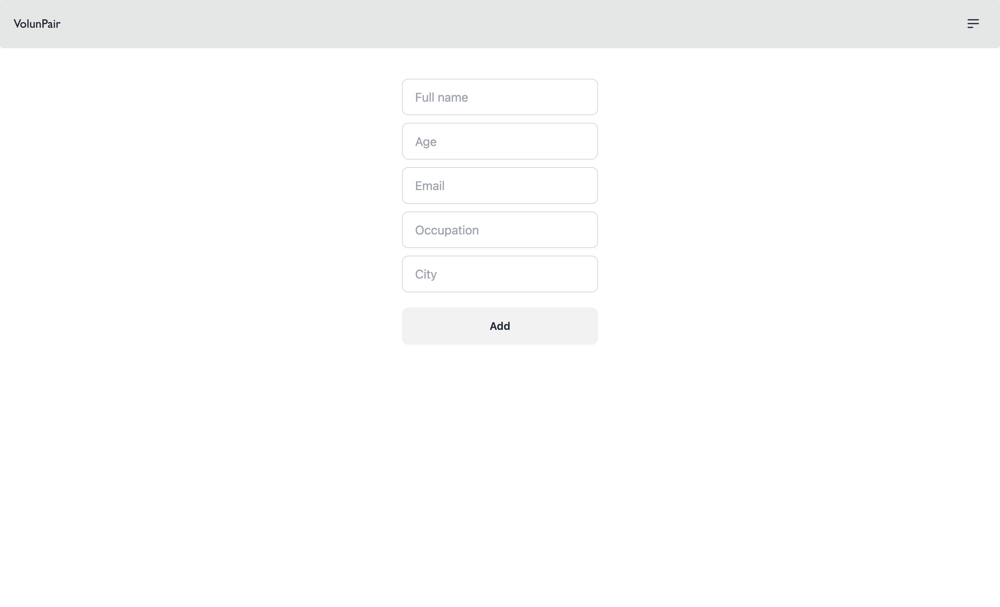
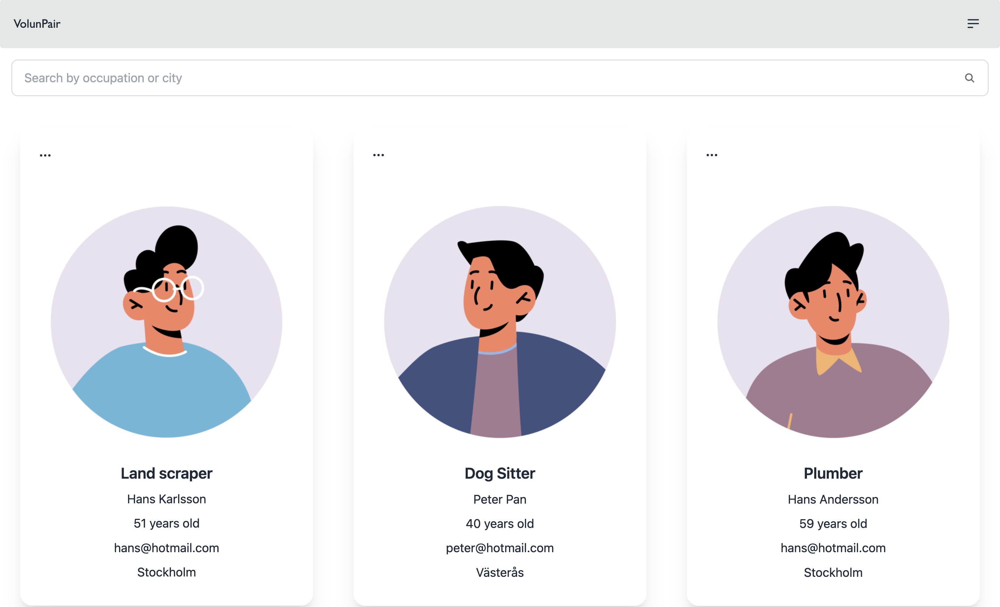

# VolunPair

VolunPair is meant as a in house tool for a organisation/agency as a central bank, if you will, to keep track of volunteers.

The functionalities as it stands are:

1. Add a new volunteer with fields
   - name
   - age
   - email
   - occupation
   - city
2. Browse profiles in a gallery.
   - Here you can search volunteers buy occupation or city
   - Delete a volunteer

This is the home view where the user can choose either to go to a different page to sign up as a volonter
of head into a gallery where all the registered volonteers are displayed.

This is the view for signing up as a new volonteer.

This is the wiev of the gallery where one can browse all the signed up volonteers and also search by city or occupation.

a hamburger meny that is fixed to the navbar to navigate between pages.

Above shows an illustration of what technologies that are used for the frontend and backend in this project.
