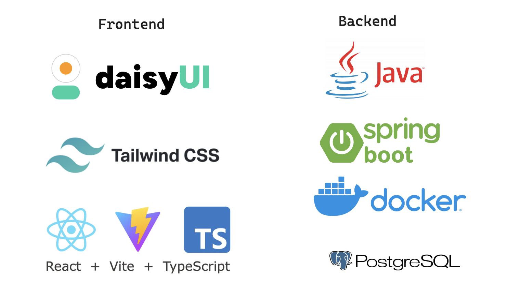

<<<<<<< HEAD
# Volonpair 
=======
# Volonpair fullstack app
>>>>>>> ebc8ff434e945bd25fedcc3512fd9fbf16492fcc

This provides the basic look of how the frontend is supposed to look and behave. The app will be build with React and TypeScript and communicate with a api to send an retrive volonteer data. 

Below serves as an initial idea of how what the project will result in however things such as style, UX/UI and choise of technnologies might be subject to change thoughout the project due to time constraints and other factors. 

This is the home view where the user can choose either to go to a different page to sign up as a volonter
of head into a gallery where all the registered volonteers are displayed.

This is the view for signing up as a new volonteer.

This is the wiev of the gallery where one can browse all the signed up volonteers.
<<<<<<< HEAD

Above shows an initial idea of what technologies that will be used throughout this project for the frontend and backend.

=======
>>>>>>> ebc8ff434e945bd25fedcc3512fd9fbf16492fcc
